# Classifier Documentation 🇪🇪

User and feature guide for the Classifier system. This document mirrors the
[Classifier Documentation Notion page](https://burokratt-classifier.notion.site/Classifier-Documentation-abcb00b12dcd4bb28745520cfca20e5d).

## Table of Contents

- [System Sign In](#system-sign-in)
- [User Management](#user-management)
- [Integrations](#integrations)
- [Datasets](#datasets)
- [Data Models](#data-models)
- [Corrected Texts](#corrected-texts)
- [Test Models](#test-models)

---

## System Sign In

- Enter the Smart ID (Estonian Personal Identification Number) on the login screen.
- Using only the authorized IDs (ID Card, Mobile ID, Smart ID, EU eID), the users will be able to log into the system.

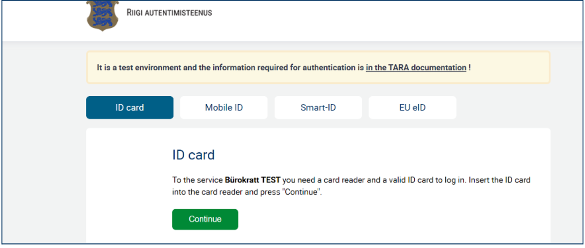

---

## User Management

> 💡 Admin users are allowed to 'Add' new users to the system or 'Edit' and 'Delete' the details of existing users.

### View All Users

For the Admin Users, on the left navigation panel, click on the 'User Management' option.

- In the table view of users, for each user the following information will be available:
  - Full Name
  - Personal ID
  - Role
  - Email
  - Action Buttons – Change, Delete
- Use the pagination options available below the table view to navigate the full list of users available in the system.
- Each column has an option that supports the sorting to sort the list alphabetically.

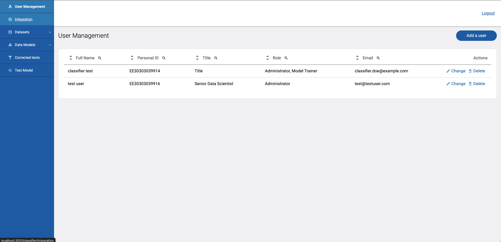

### Adding the First User to the System

- By default there will be one admin user when the system is set up in development with the personal id – `EE30303039914`.
- Using that admin user account, any number of users can be added to the system.

### Add New Users

- Click on the 'Add a user' button on the top right corner of the Admin view.
- The 'Add a New User' pop-up will be shown.
- In the pop-up fill in the details of the new user to be added:
  - **First and Last Name** – Enter the full name of the user
  - **Role** – Select from the drop-down list whether Administrator or a Model Trainer
  - **Personal ID** – Authorized IDs (ID Card, Mobile ID, Smart ID, EU eID)
  - **Title** – Designation
  - **Email** – Valid email address
- From the drop-down list in the 'Role' field users are allowed to select and assign either of the two roles or both for the new user.
- When the user is successfully added to the system, the success toast will be shown at the bottom right corner of the screen and the added user record can be seen from the 'User Table'.

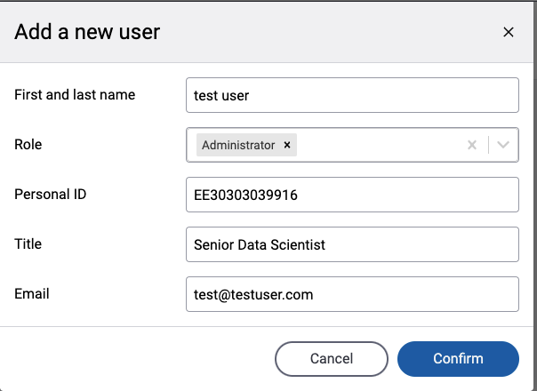

### Edit User Details

- Select the 'Change' action button of the respective user record which needs to be edited.
- The 'Edit User' pop-up modal with pre-filled user data will be shown.

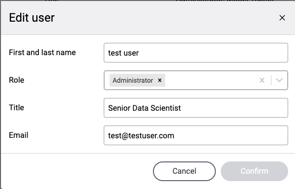

### Delete Users

- Select the 'Delete' action button of the respective user record which needs to be deleted.
- The 'Delete Confirmation' pop-up modal will be shown.
- Upon confirming the deletion, the selected user record will be deleted and thus, the corresponding user will not be able to log into the system again.

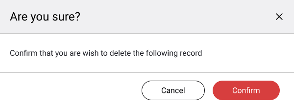

---

## Integrations

Integrations denote different platforms from which messages, inquiries, emails/attachments and support tickets come from.

The system supports two different types of integrations, namely:

- **Jira** – Atlassian issue tracking and project management software
- **Outlook** – An email client developed by Microsoft

> 💡 Only the 'Administrators' have access to this section.

### Enabling/Disabling Integrations

- Using the toggle switches, users can enable or disable one or multiple integrations from the above list.
- When an integration is active, the status is displayed as 'Connected.' Conversely, when the integration is not active, the status is marked as 'Disconnected.'
- If the connection is successful, the 'Integration Successful' pop-up is shown whereas the 'Integration Unsuccessful' pop-up is shown if the connection is not successful.
- Upon switching off an integration toggle, a confirmation pop-up will be shown to mark the user's consent.

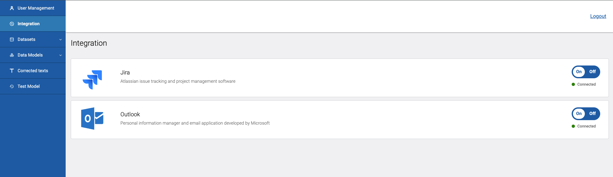

---

## Datasets

> 💡 Both 'Administrators' and 'Model Trainers' have access to this module.

### Dataset Groups

A dataset group is a schema outlining the structure and validation rules of the data that can be imported into the dataset group.

### Dataset Groups: Overview Page

- Click on the 'Dataset Groups' menu on the left navigation panel.
- This page consists of a grid view of info tiles, where each dataset group version is presented in a separate info tile.
- An advanced filter option is available for dataset group filtering. The filtering options are as follows:
  - Dataset group name
  - Version
  - Validation status (Success/Unvalidated)
  - Sorting order (A-Z / Z-A)
- Click on the 'Search' button to incorporate the selected filters and find more relevant dataset groups. If you need to remove the applied filters and return to the default view, use the 'Reset' option.
- Each info tile that represents a dataset group has the following information/buttons on them:
  - Dataset group name
  - Active/Inactive toggle switch
  - Validation status
  - Last model trained
  - Last used for training
  - Last updated
  - Version number
  - Version status
  - 'Settings' button

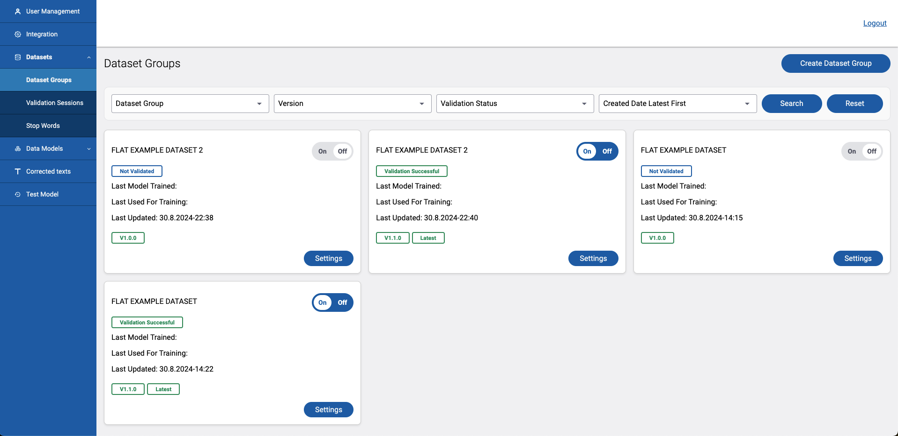

#### Dataset Groups: Create a New Dataset Group

- Click on the 'Create Dataset Group' button at the top right corner of the overview page.
- Add **'Dataset Details'**
  - Add a name to the dataset group. (No need to be a unique name, this is just an identifier.)
- Add **'Validation Criteria'**, to define the columns of the dataset group.
  - There should at least be 2 fields in the dataset group.
  - The dataset should have unique field names and the word `rowid` cannot be used as a field name (uppercase/lowercase/camel case, any format).
  - There should be at least one **'Data Class'** field in the dataset group. (In the context of a dataset, a "data class" refers to a specific category or label that data points belong to. These class labels are used to train a machine learning model to correctly categorize new, unseen data. Essentially, a data class defines the different categories that the data in the dataset can be classified into.)
  - Can add any number of validation rules and fill data using the 'Add Class' button.
  - For each rule, the 'Field Name' (Text input) and the 'Data Type' (Drop-down list – Text, Number, Date Time, Email, File Attachments) should be specified.
  - If a given field is a data class, then its checkbox needs to be ticked marking it as the 'Data Class' of the dataset group.
- Define the **'Class Hierarchy'** of the 'Data Class(es)' of the dataset group to create a hierarchical structure that helps in organizing data with multiple layers of classification.
  - Define the **'Main Classes'** (In a dataset, a main data class represents the primary or overarching category into which data points are grouped. It's the broadest classification.)
  - Define the **'Sub Classes'** (A subclass is a more specific category within a main data class. It refines the classification further.)
  - Using the 'Delete' option available at each layer/node, the user can delete any of the main and subclasses.
  - If the selected node is a subclass (child node) with no further subdivisions, it can be deleted directly. However, if the node is a main class (parent node) with further divisions, the system will prompt a message and prevent deletion.
  - When deleting, a confirmation pop-up modal will be shown.
- **Create the dataset group**
  - When all the above steps are completed, click on the 'Create Dataset Group' button at the bottom right corner of the screen to complete the addition of the dataset group.
- If the creation of the dataset group is successful, a 'Dataset Group Created Successfully' pop-up message is shown.

> **NOTE:**
> - There will be inline validation errors if there are any validation issues in validation rules and class hierarchy.
> - An error will also be shown if the validation criteria requirements are not met (there should be at least 2 rules and at least one data class).

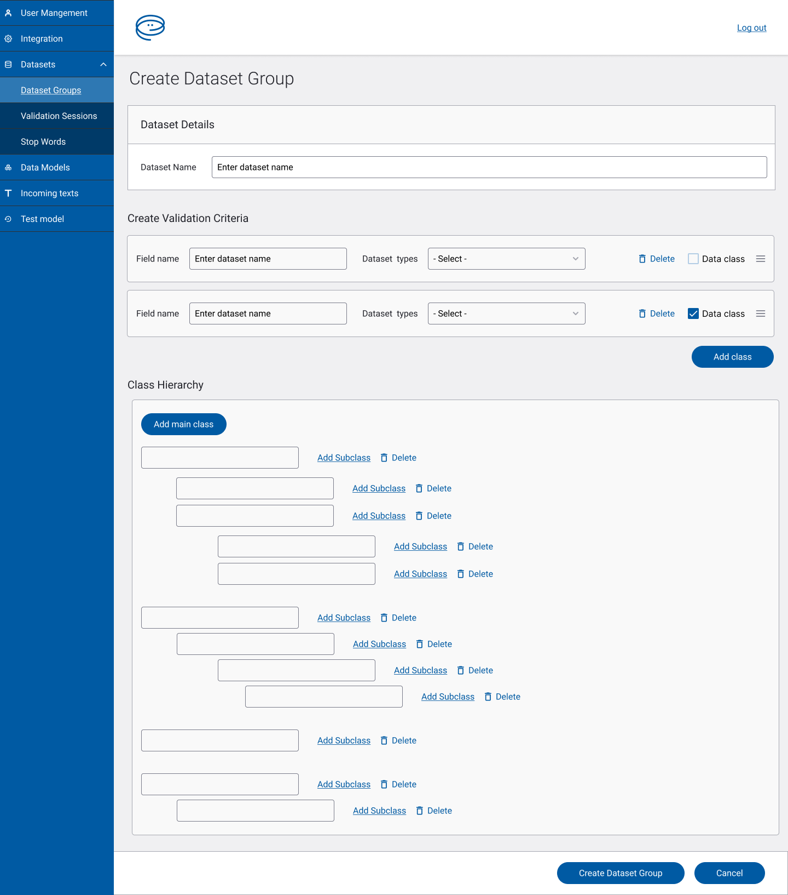

### Dataset Groups: Detail Page of a Dataset Group

- When clicking on the 'Go to Detailed View' button on the above-mentioned dataset group creation success pop-up, or the 'Settings' button on the corresponding info tile on the overview page, the user can be directed to the detail page of the dataset.
- The dataset name, Version Number, Validation Status, Version Status, Connected Data Models and Number of items are shown at the top of the detail page.
- The 'Back' button at the top left corner of the page directs the user to the 'Dataset Groups Overview Page'.
- On the right side of the page, two buttons will be shown: 'Export Dataset' and 'Import New Data'.
- **Before importing data:**
  - The added field structure should be visible.
  - The 'No Data Available' banner with the 'Import New Data' button will be shown.
- **Import data:**
  - Click on the 'Import New Data' button either from the banner or the right side of the page.
  - The 'Import New Data' pop-up modal will be opened.
  - Specify the file format (XLSX, JSON, YAML) and use the 'Choose' file option to find the correct file by opening the file selector window.
  - There should at least be 10 records for a dataset to be considered to activate a dataset group.
  - The uploading progress will be shown in the pop-up modal itself.
- **Save data:**
  - After importing a dataset, the user is shown a red banner asking to save the dataset.
  - By clicking on the 'Save' button at the bottom right corner, the user can save the dataset. This will create a new minor version of the dataset group. This will take around 1–2 minutes.
  - When saved successfully, the user will get directed to the Dataset Groups Overview Page.
- **Preview dataset:**
  - By clicking on the respective dataset group's version card from the overview page, the user gets directed to the dataset group detail page from which the imported dataset can be previewed after saving. Here pagination options should be used to see the entire dataset.
  - For each record in the dataset, there should be 'Change' and 'Delete' buttons.

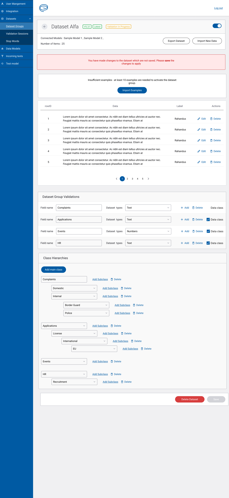

### Dataset Groups: Updates

#### Dataset Groups: Major Update

- In the imported dataset, any changes made to the dataset group validations — adding, deleting or editing an existing validation, or any addition, deletion or edit made to the class hierarchy — will be counted as a major update.

#### Dataset Groups: Minor Update

- Importing data to an empty or an existing Dataset Group will be counted as minor updates.

#### Dataset Groups: Patch Update

- In the imported dataset, for the respective records, by clicking on the 'Change' or the 'Delete' buttons, the required changes can be made accordingly.
- After each patch update, the 'Save' button should be clicked to incorporate the added changes to the dataset.

### Dataset Groups: Delete Dataset Group

- Using the 'Delete Dataset' button at the bottom of the screen, the user can delete any selected dataset group.
- The delete confirmation pop-up will appear.
- If confirmed, the selected version of the dataset group will get deleted and removed from the info tile grid view on the 'Dataset Group Overview' page.

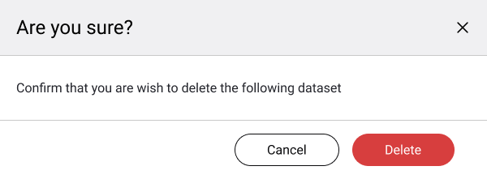

### Dataset Groups: Export Dataset Group

- This functionality will only be available if the dataset group is properly configured with a valid dataset.
- Click on the 'Export Dataset' button at the top right corner.
- Specify the format of the dataset export (XLSX, JSON, YAML).
- When the dataset is successfully exported, a success pop-up will be shown and the exported dataset file will get downloaded to the device in the selected format.

### Validation Sessions

Validation sessions ensure the model's accuracy.

- Click on the 'Validation Sessions' sub-menu under 'Datasets'.
- Can oversee the real-time validation progress and the statuses of the available datasets.
- In a case where the validation has failed, the reason for the failure will be mentioned.
- If the validation is successful, it'll be shown as a 'Successful Upload'.

### Stop Words

Stop words in a dataset are common words that are often filtered out before processing. They are usually removed because they do not carry significant meaning and can clutter the analysis or model training. By excluding stop words, the focus is placed on more meaningful words that are likely to contribute to the classification.

- Click on the 'Stop Words' sub-menu under 'Datasets'.
- On the landing screen, the available set of stop words will be shown in chips.
- Users can type the required stop word in the input field and click on the 'Add' button to manually add a stop word to the existing list.
- By clicking on the 'X' button on the Stop Word chips, the user can delete any of the added stop words from the list.
- Using the 'Import Stop Words' button, the user can initiate a bulk import of stop words and append it to the existing list or delete it from the existing list.
- When clicked on the 'Import Stop Words', a pop-up modal will appear, through which the file and required action selection will happen. Here, there are 2 action types to select from, namely:
  - **Import to add** – add to the existing list
  - **Import to delete** – delete from the existing list
- When an import is in progress, a pop-up modal will notify you of the ongoing process. Once the import is completed, a similar pop-up modal will confirm the completion.

---

## Data Models

> 💡 Both 'Administrators' and 'Model Trainers' have access to this section.

The data model feature enables the user to create data models from the datasets created in the datasets module and deploy them to Jira, Outlook or Testing environments.

### Data Models: Overview Page

#### Production Models

A production-ready data model is a machine learning model that has been fully developed, trained, and tested using a specific dataset and is now ready for deployment in a real-world environment. It means the model is robust, has undergone sufficient validation, and meets performance criteria such as accuracy, speed, and scalability. In production, the model can reliably make predictions or decisions based on new data and is integrated into an application or system for use by end-users or automated processes.

These models are integrated with platforms Jira or Outlook and the count of the production models should be equal to the count of active integration platforms at any given time. Upon creation of a new production model, the old production model is always replaced by the new one for a given platform.

#### Data Models

This section includes both production data models as well as normal data models.

- Click on the 'Data Models' menu on the left navigation panel.
- This page consists of a grid view of info tiles, where each data model is presented in a separate info tile.
- An advanced filter option is available for data model filtering. The filtering options are as follows:
  - Model name
  - Version
  - Connected platform
  - Dataset group
  - Training status
  - Development status
  - Sorting order (A-Z / Z-A)
- Click on the 'Search' button to incorporate the selected filters and find more relevant data models. If you need to remove the applied filters and return to the default view, use the 'Reset' option.
- Each info tile that represents a data model has the following information/buttons on them:
  - Data model name
  - Data model version number
  - 'Latest' tag (optional)
  - Dataset group
  - Dataset group version
  - Last trained timestamp
  - Labels – Training status, Connected platform, Maturity level
  - 'View Results' button
  - 'Settings' button

### Data Models: Create a New Data Model

- Click on the 'Create Data Model' button at the right corner of the Data Models section of the overview page.
- Add a name to the data model. (No need to be a unique name, this is just an identifier.)
- The model version is pre-filled (initially it is V1.0).
- Select the required dataset group from the dropdown list. (Here only the dataset groups which are enabled will get listed.)
- Select the required base model or models:
  - Distil-BERT
  - RoBERTa
  - BERT

  > **Note** – The above explanations of the model are based on general performance. Choose the ideal model by experimenting with different models on your dataset.

- Select the preferred deployment platform (only one platform is allowed).
- Select the maturity label.
- Click on the 'Data Model' button.
- If the creation is successfully completed, a 'Data Model Created and Started Training' success pop-up will be shown and the created data model will be listed on the overview page.
- The 'View All Data Models' button will direct the user to the 'Data Models Overview Page'.
- When a new production data model is created, it will either replace any existing model for the same platform or, if no previous model exists, it will add the new data model for the selected platform.

### Data Models: Configure a Data Model

- When clicking on the 'Settings' button on the corresponding info tile on the data models overview page, the user can get directed to the detail page of that data model.
- From this page, the user is allowed to make any changes to a created data model.
- When changes are done, click on the 'Save' button to save the changes.
- If successfully updated, the 'Changes Saved Successfully' success pop-up modal will be shown.
- When a production data model is updated, the new version of the data model will either replace any existing model for the same platform, whereas any existing model will be marked as 'Undeployed'.

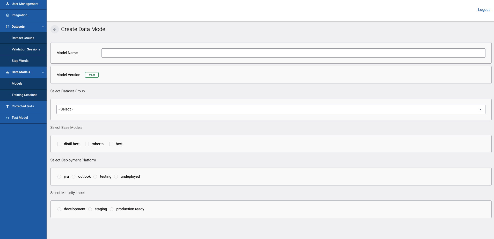

### Data Models: Updates

- After any update, the 'Save' button should be clicked to incorporate the added changes to the data model.
- After each update the data model should be 'Retrained'.

### Data Models: Testing a Data Model

You can test a data model by sending an input to its deployed environment. For example, to check a model in Outlook you can send an email to the integrated inbox to check whether the email is put into the right folder.

To test a model deployed to Jira you can create a service desk ticket on the connected Jira account.

### Data Models: Delete a Data Model

- Click on the 'Delete Model' button at the bottom right corner of the 'Data Model Configure Page'.
- A confirmation pop-up modal will be shown.
- When confirmed, it will be deleted and removed from the overview page.
- Here, for production models a warning message will be displayed as an additional step when deleting.

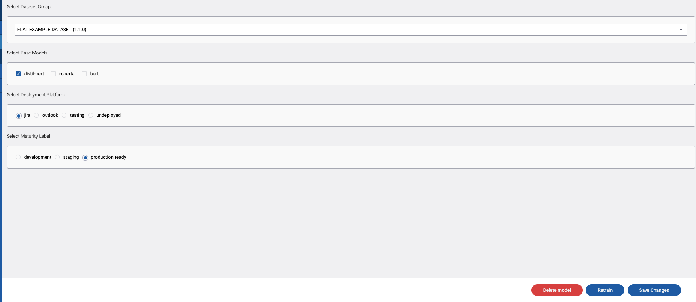

### Data Models: View Training Results

- When clicking on the 'View Training Results' button on a specific info tile on the Data Models page, a pop-up message will appear displaying the highlights from the model training.

---

## Corrected Texts

> 💡 Both 'Administrators' and 'Model Trainers' have access to this section.

This section contains updates made by human users to the classifier outcomes. For instance, if a data record is misclassified or incorrectly classified, it can be manually corrected, and those manually corrected entries will be listed here. Depending on the deployed platform, the data records can be filtered for easy reference.

- Click on the 'Corrected Texts' menu from the left navigation bar.
- Select the required platform from the filter dropdown to see the corrected texts for a given platform.
- Click the 'Export' button in the top right corner to download an export of the data table.
- Use the pagination options to view all the data records.

---

## Test Models

> 💡 Both 'Administrators' and 'Model Trainers' have access to this section.

The test model interface can be used to test any models that are deployed to the "Testing" deployment environment.

- Click on the 'Test Models' option from the left navigation menu.
- Select the desired data model from the dropdown menu.
- Enter a sample text (test case) to run a classification test.
- Click on the 'Classify' button to view the results.
